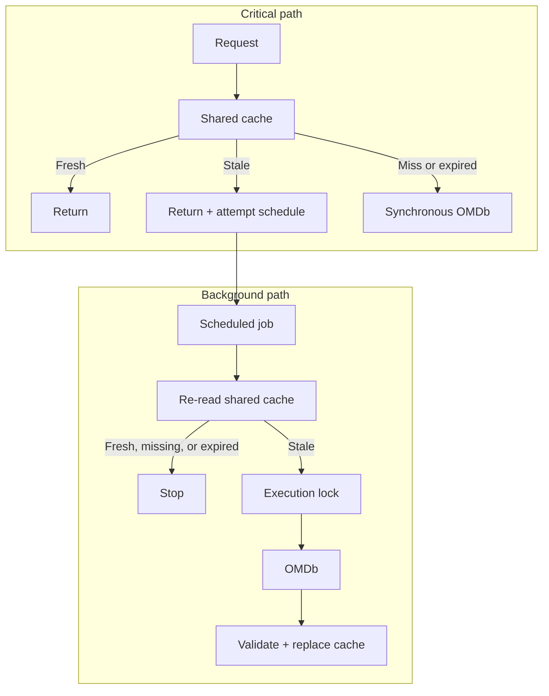

<div align="center">


# WP Movie Showcase

A production-oriented Gutenberg plugin demonstrating resilient external API integration, adaptive caching, stale-while-revalidate, stampede protection, accessibility, and WordPress VIP engineering practices.

[](https://github.com/cirinojr/wp-movie-showcase/actions/workflows/ci.yml)
[](https://www.php.net/)
[](https://wordpress.org/)
[](LICENSE)

[Architecture](#cache-architecture) · [Measured behavior](#measured-behavior) · [Installation](#installation) · [Tests](#development)

</div>

## What this project demonstrates

WP Movie Showcase is a working movie and TV search block, but its engineering focus is the boundary between WordPress and a latency- and quota-constrained external API. It demonstrates PHP 7.4-compatible backend design, Gutenberg and native JavaScript, public REST endpoints, cache concurrency, failure tolerance, automated testing, CI, and accessible interaction.

### Engineering highlights

- Adaptive caching retains movies according to actual demand.
- SWR returns bounded stale data immediately and schedules eventual background revalidation.
- Scheduling and execution coordination deduplicates stale requests and delayed workers before OMDb calls.
- Database ownership checks prevent an old worker from releasing a newer lease; Object Cache locks use lease-only release.
- Explicit alias invalidation plus namespace generation, schema versioning, and API-key-scoped cache keys keep obsolete entries unreachable.
- Persistent object caches are supported, with Transients as a portable alternative.
- Short-lived negative caching avoids repeatedly requesting known misses.
- API failures do not overwrite usable stale data.
- The OMDb key remains server-side and is hashed in cache namespaces.
- AbortController and request IDs prevent stale frontend responses winning races.
- A bounded in-memory suggestion cache avoids unbounded browser growth.
- Keyboard navigation, ARIA combobox semantics, and live announcements are preserved.
- PHPUnit, WordPress VIP PHPCS, JavaScript/style linting, and production builds run in CI.

## Why this architecture exists

External API calls introduce latency, processing cost, rate-limit pressure, and an external availability dependency. The cache architecture avoids unnecessary upstream calls and returns frequently requested data immediately, while stale-while-revalidate keeps the interface responsive without giving up eventual freshness.

| Engineering decision | Practical consequence |
|---|---|
| Reuse fresh cached data | Fewer OMDb calls and less quota pressure |
| Return cached data | Less user-facing latency |
| Serve stale and schedule background revalidation | The current visitor does not wait for WP-Cron execution |
| Coordinate scheduling and worker execution | Concurrent requests and delayed jobs do not unnecessarily fan out upstream |
| Preserve stale after refresh failure | Temporary OMDb failure does not immediately become user-facing failure |

## Cache architecture



Frequently accessed movies are promoted after five cache hits and remain fresh for seven days instead of the normal 12 hours. SWR begins only after the applicable fresh window. Concurrent stale requests are deduplicated when scheduling refreshes, while delayed workers re-check persistent cache freshness and coordinate execution before contacting OMDb.

Scheduling deduplication is not execution deduplication. Because WP-Cron may run after a refresh lease has expired, the worker must re-check shared cache state before contacting the upstream service. Missing or expired entries are not recreated by an obsolete background job; normal requests remain responsible for synchronous misses.

If a background refresh times out or receives an invalid upstream response, the valid stale entry remains available until its bounded stale window ends. Negative responses stay short-lived and never use SWR, preventing an old “not found” result from hiding newly available data.

See [Cache Architecture](docs/cache-architecture.md) for lifecycle details, invalidation, locking behavior, observability, failure modes, and trade-offs.

## Measured behavior

The deterministic benchmark was run locally on PHP 8.2.12 with a mocked 50 ms OMDb delay:

| Scenario | Cache state | Perceived time | OMDb calls |
|---|---|---:|---:|
| Cold request | `CACHE_MISS` | 56.378 ms | 1 |
| Fresh cache hit | `CACHE_FRESH` | 0.124 ms | 0 |
| Stale cache hit | `CACHE_STALE` | 0.135 ms | 0 |
| Stale after failed refresh | `CACHE_STALE` | 0.294 ms | 0 |

These are measured harness results, not production latency claims. Run `npm run benchmark` in the target environment for a comparable local measurement.

## Demo

The banner is presentation artwork, not a fabricated product screenshot. A [real screenshot checklist](docs/presentation-checklist.md) defines the block-editor, autocomplete, movie-result, and settings captures still needed from an actual WordPress session.

## Features

- Dynamic Gutenberg block with server-side rendering.
- Movie and TV title search through the OMDb API.
- Autocomplete with up to five suggestions.
- Exact title selection by IMDb ID.
- Responsive loading skeleton and result card.
- Support for multiple independent blocks on one page.
- Keyboard-friendly combobox and live status announcements.
- Server-side API key handling and response normalization.
- Request-local caching with persistent WordPress Object Cache when available, or Transients as the portable persistent fallback.

Results can include the poster, title, year, age rating, runtime, genre, director, plot, and IMDb rating. Missing values are omitted gracefully.

## Requirements

- WordPress 6.4 or newer.
- PHP 7.4 or newer.
- JavaScript enabled in the visitor's browser.
- A valid [OMDb API key](https://www.omdbapi.com/apikey.aspx).

## Installation

### From GitHub

1. Download the repository as a ZIP from GitHub.
2. In WordPress, open **Plugins > Add New Plugin > Upload Plugin**.
3. Select the downloaded ZIP and choose **Install Now**.
4. Activate **WP Movie Showcase**.

Tagged releases automatically produce a tested installable ZIP through the release workflow. Until the first release is tagged, use the repository ZIP or clone the project.

### With Git

Clone the repository inside `wp-content/plugins`:

```bash
git clone https://github.com/cirinojr/wp-movie-showcase.git
```

Then activate **WP Movie Showcase** from the WordPress Plugins screen.

## Configuration

Open **Settings > Movie Showcase**, enter your OMDb API key, and save the settings.

The key can alternatively be supplied through `wp-config.php`:

```php
define( 'WP_MOVIE_SHOWCASE_OMDB_API_KEY', 'your-api-key' );
```

The plugin also accepts the `WP_MOVIE_SHOWCASE_OMDB_API_KEY` and `OMDB_API_KEY` environment variables. A constant or environment variable takes precedence over the value saved in WordPress.

> Never commit a real API key to the repository.

## Usage

1. Edit a post or page in the block editor.
2. Insert the **Movie Search** block.
3. Publish or preview the page.
4. Type at least three characters to display suggestions.
5. Select a suggestion or press Enter to search for the typed title.

Keyboard controls include Arrow Up, Arrow Down, Enter, Escape, and Tab.

## How it works

The block frontend sends a request to WordPress. WordPress validates the request, calls OMDb from the server, normalizes the response, and returns only the data needed by the interface. The API key never needs to be included in client-side JavaScript.

Cache lookup flow:

1. Request-local memory.
2. One persistent backend: WordPress Object Cache when configured, or Transients as the portable fallback.

Complete movie results are cached for 12 hours and may be promoted to a seven-day hot cache. Suggestions are cached for six hours, while empty suggestions and not-found responses use a short 15-minute cache. Errors are not cached.

## Security and accessibility

- The OMDb API key remains server-side.
- The settings screen requires the `manage_options` capability.
- The stored key is not exposed through the REST API.
- Remote responses are validated and normalized.
- The search field has a visible label.
- Autocomplete uses combobox and listbox semantics.
- Status updates are announced through an `aria-live` region.

The search routes are intentionally public because visitors use them without authentication. Cache reuse limits repeated identical calls, but arbitrary unique queries can still consume upstream quota. Production operators should apply host-, CDN-, or WAF-level rate controls when abuse is a concern; a WordPress nonce would not rate-limit or authorize a public endpoint.

## Project structure

```text
wp-movie-showcase/
├── .github/                # CI, release automation, and Dependabot
├── build/                  # Committed production assets used by WordPress
├── docs/                   # Architecture and presentation documentation
├── includes/               # Settings, cache lock, service, and plugin wiring
├── src/                    # Gutenberg and frontend source files
├── tests/                  # PHPUnit suite, WordPress stubs, and benchmark
├── composer.json           # PHP testing and quality tooling
├── package.json            # JavaScript tooling
├── phpunit.xml.dist        # PHPUnit configuration
└── wp-movie-showcase.php   # Plugin entry point
```

## Development

### Quick start

```bash
composer install
npm ci
npm run build
composer test
composer lint
```

Available commands:

```bash
npm run start       # Watch and rebuild assets
npm run build       # Create production assets in build/
npm run lint:js     # Lint JavaScript
npm run lint:css    # Lint SCSS
npm run benchmark   # Compare cold, fresh, stale, and failed-refresh paths
npm run zip         # Generate an installable plugin ZIP
composer test       # Run the PHPUnit cache/concurrency suite
composer lint       # Run WordPress VIP PHPCS
composer test:all   # Run PHPUnit and PHPCS
```

Before publishing a release, rebuild the assets, run the linters, and generate a fresh ZIP.

## Troubleshooting

**The movie service is not configured**  
Save a valid key under **Settings > Movie Showcase**, or provide it through a supported constant or environment variable.

**No suggestions or results appear**  
Check the spelling and confirm that the WordPress server can make outbound HTTPS requests. Empty and not-found results remain cached for 15 minutes.

**The frontend form does not respond**  
Confirm that JavaScript is enabled and that the files from `build/` are loading.

**Results appear stale after changing the API key**  
The cache namespace changes with the active API key, so subsequent requests use a fresh namespace.

## License

Licensed under [GPL-2.0-or-later](https://www.gnu.org/licenses/gpl-2.0.html).

WP Movie Showcase is not affiliated with IMDb or OMDb. Movie data is supplied by the OMDb API.
