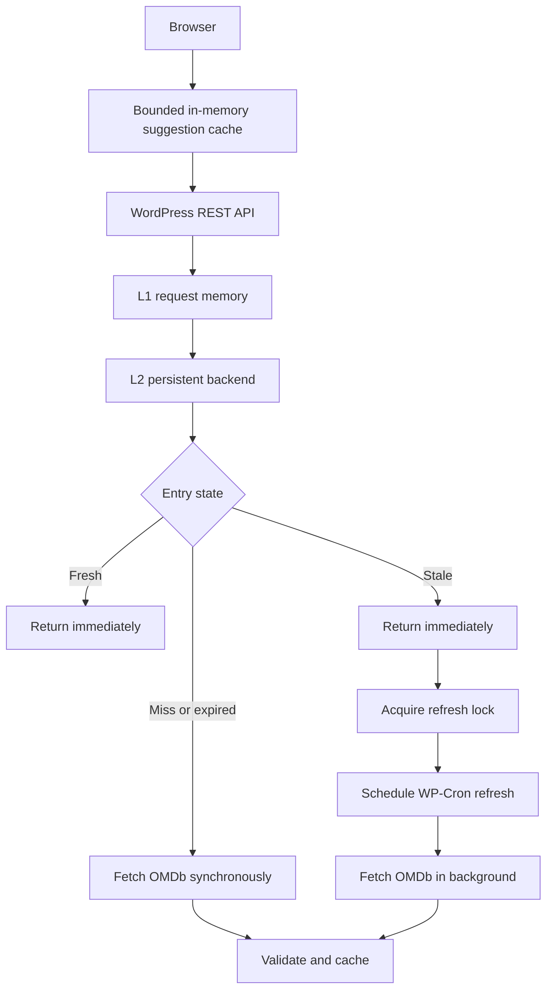

# Cache Architecture

## Why this architecture exists

External API calls add latency, processing cost, rate-limit pressure, and an external availability dependency. WP Movie Showcase therefore keeps reusable data close to WordPress and only contacts OMDb when the cached representation can no longer satisfy the request.

The design combines three complementary policies:

- **Adaptive caching** determines how long frequently requested movies remain fresh.
- **Stale-while-revalidate (SWR)** returns usable data immediately while refreshing it asynchronously.
- **Stampede protection** ensures concurrent stale requests do not all refresh the same key.

## Cache hierarchy



L2 uses the persistent WordPress object cache when one is configured. Otherwise it uses Transients. These are alternative persistent backends, not two sequential cache layers.

## Entry lifecycle

Each persistent entry is a versioned envelope:

```php
[
    'schema'      => 4,
    'type'        => 'movie',
    'value'       => $movie,
    'cached_at'   => 1700000000,
    'fresh_until' => 1700043200,
    'stale_until' => 1700129600,
]
```

- **Fresh:** return immediately and make no upstream request.
- **Stale:** return immediately and attempt to schedule one background refresh.
- **Expired:** delete the unusable entry and fetch synchronously.
- **Miss:** fetch synchronously.

Physical storage lasts until `stale_until`; this does not change the original fresh TTL.

## Preserved cache policy

| Data | Fresh window | Stale grace | Notes |
|---|---:|---:|---|
| Movie detail | 12 hours | 24 hours | Existing fresh TTL preserved |
| Hot movie detail | 7 days | 24 hours | Existing promotion behavior preserved |
| Suggestions | 6 hours | 1 hour | Existing fresh TTL preserved |
| Empty suggestions | 15 minutes | None | Existing negative TTL preserved |
| Movie not found | 15 minutes | None | Existing negative TTL preserved |

Movies are promoted after five persistent-cache hits. The hit count remains capped at 100. Promotion and hit updates keep the legacy sliding fresh-window behavior.

## Why negative entries do not use SWR

A negative response is useful briefly because it prevents repeated identical misses. Serving it stale could hide a title that OMDb adds or corrects later. Negative entries therefore remain fresh for 15 minutes and expire without a stale grace period.

## Stampede protection

The refresh lock is scoped to the hashed cache key and has a two-minute lease. With a persistent object cache, acquisition uses atomic `wp_cache_add()`. Without one, acquisition uses the uniqueness of `add_option()`, which is shared through the WordPress database across PHP processes.

The lock stores a random ownership token. A successful worker releases only the lock it owns, reducing the risk that a delayed worker deletes a newer lease. A failed refresh deliberately leaves the short lease in place as a two-minute retry backoff. The TTL also allows recovery after a fatal error or abandoned cron job.

One refresh is scheduled per lock lease. WordPress Cron is intentionally used because it has no required external dependency and is compatible with standard WordPress and WordPress VIP. Like all WP-Cron work, execution depends on site traffic unless the installation connects WP-Cron to a system scheduler.

## Failure handling

Timeouts, DNS failures, non-200 responses, rate limits, malformed JSON, and invalid payloads do not overwrite a valid stale entry. Users continue receiving stale data until `stale_until`. After that boundary, the entry is not served indefinitely: the request receives the normalized upstream error if a new fetch fails.

## Invalidation

Cache keys include the operation, normalized title or IMDb ID, cache namespace, schema version, and a truncated hash of the API key. The API key itself is never stored in plaintext in the key.

Invalidation is available at four levels:

- `invalidate_movie()` removes known title and/or IMDb ID keys.
- `invalidate_search()` removes one normalized suggestion query.
- `invalidate_namespace()` increments the namespace generation for a logical full purge.
- `CACHE_SCHEMA_VERSION` makes incompatible envelopes unreachable after a schema change.

Changing the API key automatically selects a different hashed namespace.

## Browser cache

The frontend retains its existing bounded, navigation-local `Map` for suggestions. Its 50-query limit caps one navigation at no more than roughly 250 normalized suggestion records (five per query), while avoiding repeat REST calls without serialization or main-thread storage work. `sessionStorage` and client-side SWR were deliberately not added: the server already returns fresh or stale values quickly, and another persistence layer would add invalidation and privacy complexity for a small response-time benefit.

The browser may revalidate against WordPress, but only the server decides whether OMDb must be contacted. This prevents browser and server SWR from producing duplicate upstream requests.

Intent-based detail prefetch was also left out. Pointer and keyboard movement through a five-item list is too weak a signal to justify extra REST traffic, and selection already benefits from the server's ID cache.

## HTTP caching

ETag and shared `Cache-Control` headers are deliberately not emitted. WordPress REST responses can pass through hosts and CDNs with different cache policies, while the authoritative fresh/stale decision depends on server-side envelope timestamps and refresh locks. Adding proxy caching here could keep responses beyond the plugin's invalidation boundary. The development-only cache status header provides observability without changing HTTP cache semantics.

## Observability

Set `WP_MOVIE_SHOWCASE_CACHE_DEBUG` to `true` (or enable `WP_DEBUG`) to log cache events and add the `X-WP-Movie-Cache` REST response header. Possible events include `MEMORY_HIT`, `CACHE_FRESH`, `CACHE_STALE`, `CACHE_MISS`, `UPSTREAM_FETCH`, `SWR_REFRESH`, `SWR_LOCKED`, and `NEGATIVE_HIT`. No keys, API credentials, queries, or movie payloads are logged.

## Trade-offs

- Stale data may be returned for a bounded period in exchange for lower latency and resilience.
- WP-Cron is portable but does not guarantee immediate execution on sites without traffic.
- Cache envelopes consume more storage than raw values.
- Namespace invalidation leaves unreachable entries until their physical TTL expires; this avoids backend-specific wildcard deletion.
- Database option locks add a small write cost on installations without persistent object caching.

## When SWR should NOT be used

SWR is inappropriate when stale information can cause an unsafe or irreversible decision, including:

- financial transaction state;
- inventory where immediate consistency is mandatory;
- security, authorization, or revocation data;
- medical or emergency information that cannot tolerate staleness;
- any workflow where the latest write must be read immediately.

Movie metadata tolerates a bounded stale window, which makes SWR an appropriate trade-off here.

## Reproducible benchmark

Run:

```bash
npm run benchmark
```

The harness applies a deterministic 50 ms delay to the mocked upstream and reports perceived request time plus OMDb call count for cold, fresh, stale, and failed-refresh scenarios. It does not claim production latency; use the same command and REST debug header in the target environment for deployment-specific measurements.
